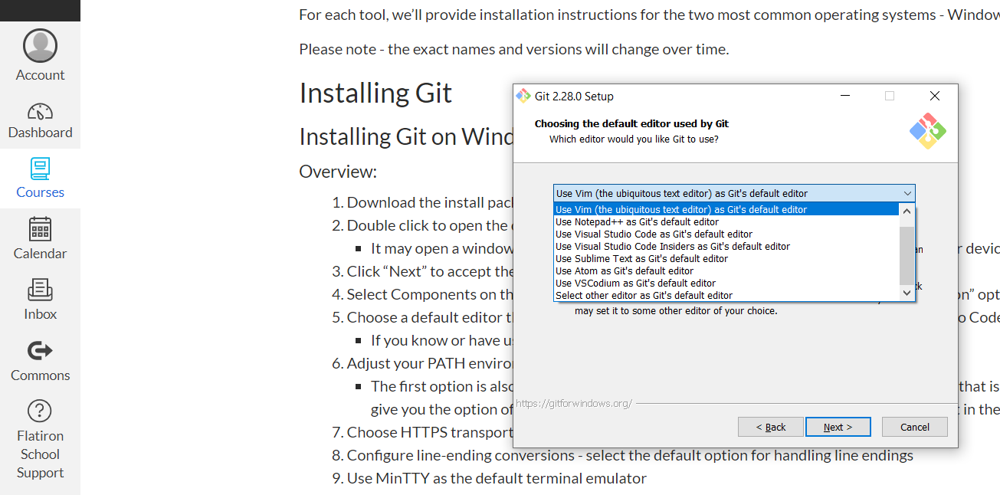
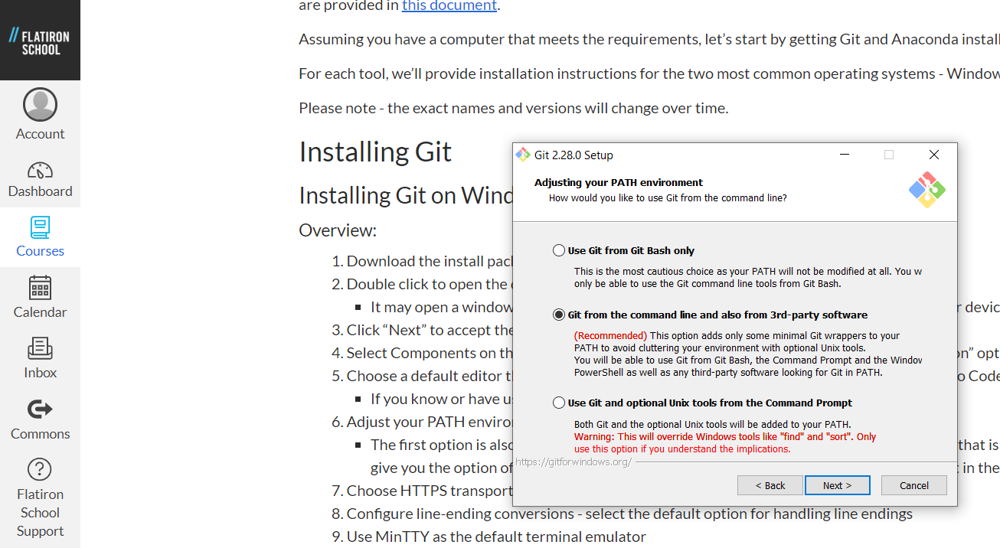
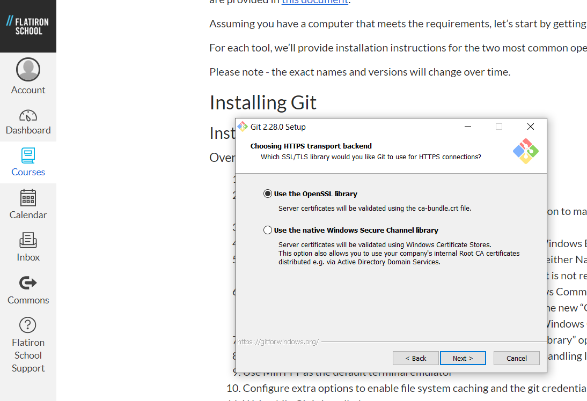
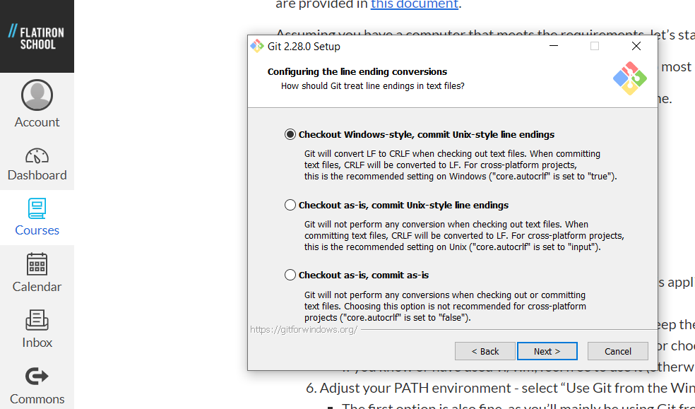
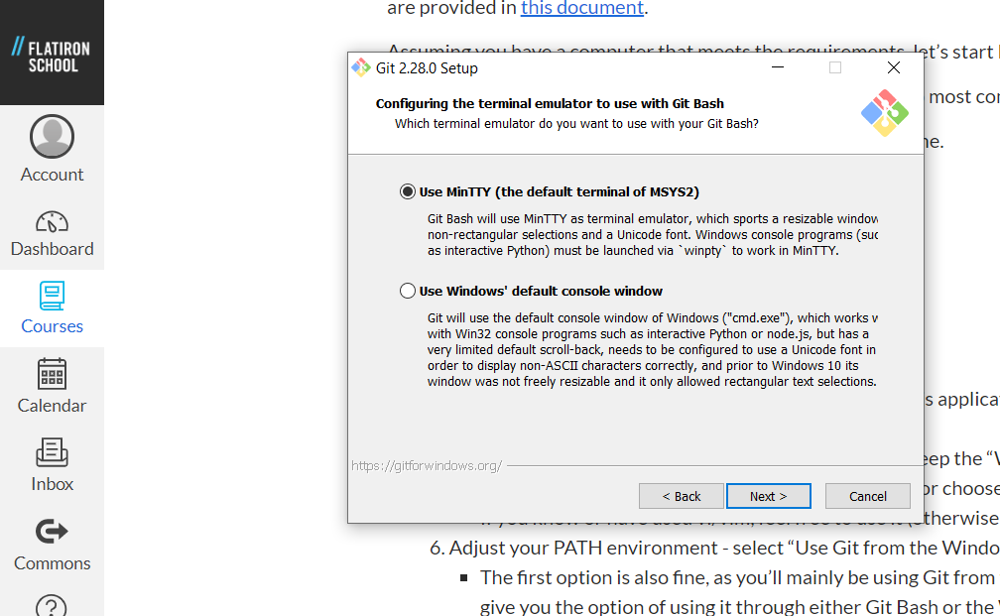
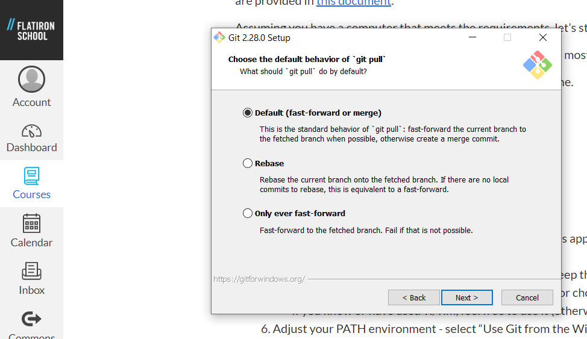
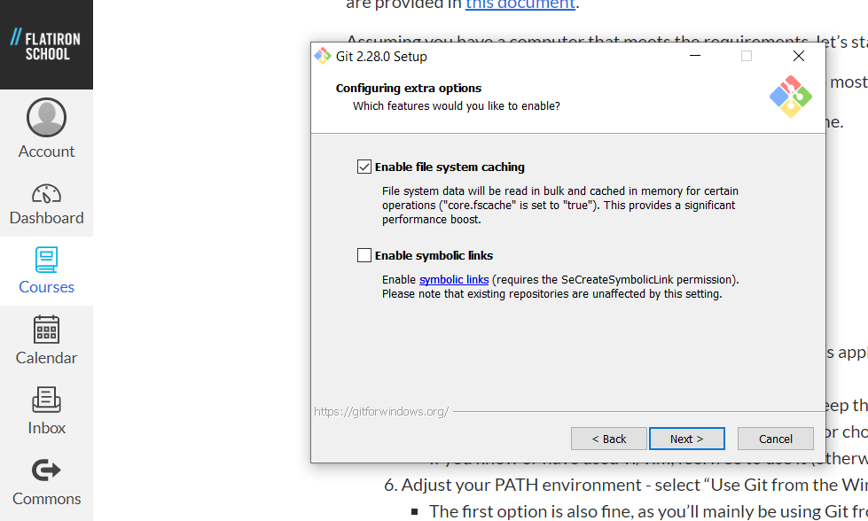
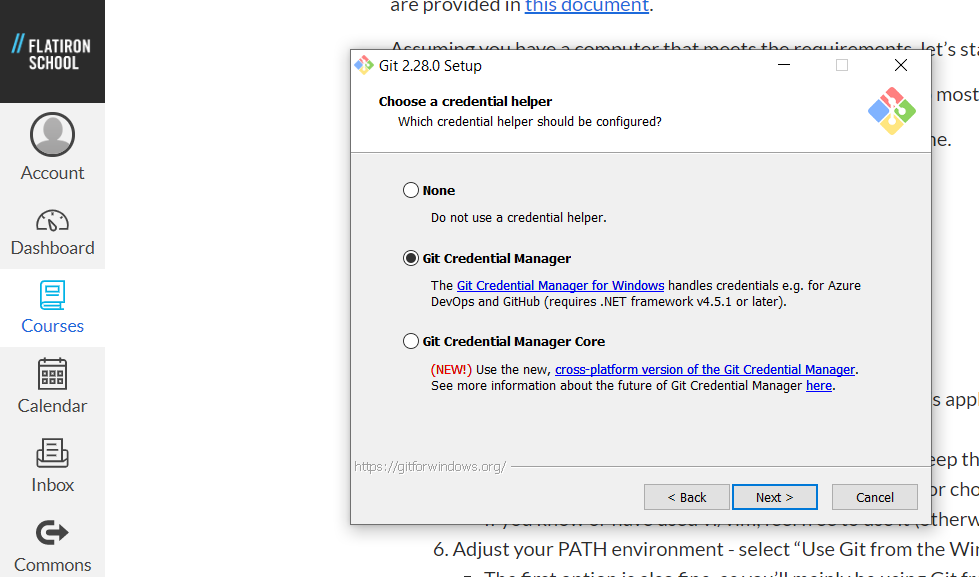
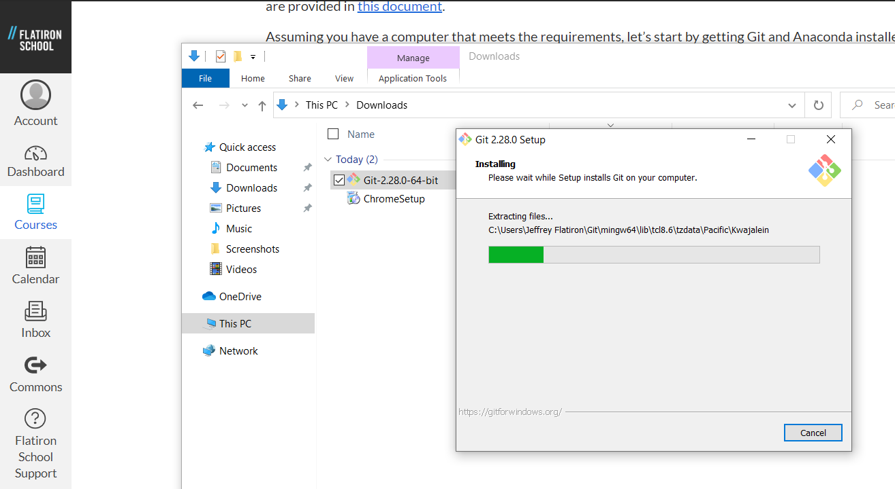
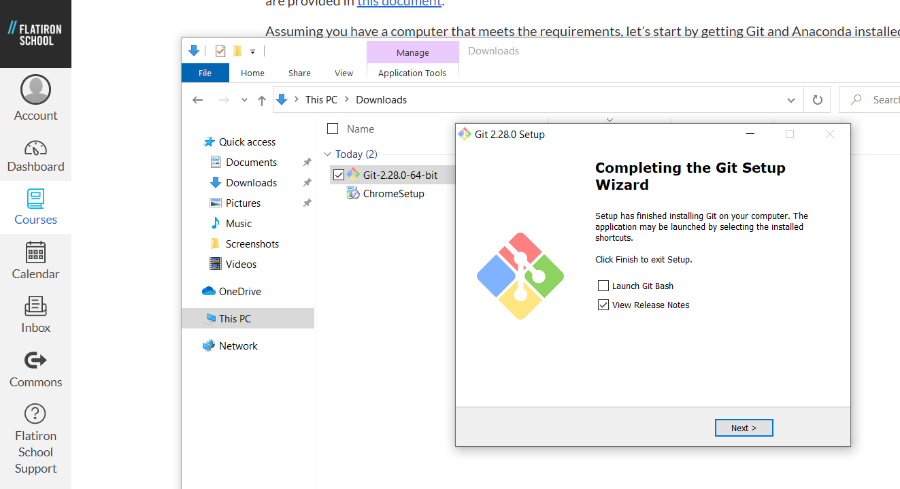

# Setting up a Professional Data Science Environment - Windows Installation

## Introduction

Windows

## Objectives

You will be able to:

* Install Git
* Install Anaconda

Let’s start by getting Git and Anaconda installed.

Please note - the exact names and versions will change over time.

## Installing Git

### Overview: 

1. Download the install package from [here](https://git-scm.com/download/win)
2. Double click to open the downloaded exe file
    - It may open a window asking if you want to allow this application to make changes to your device, click “Yes”
    - Click “Next” to accept the license
3. Select Components on the next screen. 
    - make sure to keep the “Windows Explorer integration” options checked
4. Choose a default editor that you are comfortable with, or choose either Nano or Visual Studio Code if you have not used an editor before
    - If you know or have used vi/vim, feel free to use it (otherwise it is not recommended)
    - You must have the editor installed to continue.  You can set a default now and change it later.
5. Adjust your PATH environment. 
    - select “Use Git from the Windows Command Prompt”
    - The first option is also fine, as you’ll mainly be using Git from the new “Git Bash” program that is being installed, but the second option is ideal as it’ll give you the option of using it through either Git Bash or the Windows Command Prompt in the future if you wish
6. Choose HTTPS transport backend. 
    - select the “Use the OpenSSL library” option
7. Configure line-ending conversions. 
    - select the default option for handling line endings
8. Use MinTTY as the default terminal emulator
9. Configure extra options to enable file system caching and the git credential manager
10. Wait while Git is installed onto your computer
11. Click "Finish" to complete set-up

\* It is **strongly suggested** that you select any options to install and use the "Git Bash" shell - it's generally included by default. The Git Bash shell will allow students with either Windows or Mac computers to run the same set of commands.

Note - if there are any differences in the options provided in the installer you download, accept the defaults.

#### Git Installation Steps, step-by-step:

Step 1 - Accept License: 

>   

***

Step 2 - Select Destination:

   

***

Step 3 - Select components:  

***

Step 4 - Select default editor:  

***

Step 5 - Adjust your PATH environment:  

***

Step 6 - Choose HTTPS transport backend

***

Step 7 - Configure line-ending conversions

***

Step 8 - Configure the terminal emulator to use with Git Bash

***

Step 9 - Configure extra options

***

Step 10 - Configure extra options

***

Step 11 - Choose a credential helper

***

Step 12 - Installation

***

Step 13 - Complete!

>

***

## Installing Anaconda 

The easiest way to get set up with Python and Jupyter Notebook so you can start coding is to install the Anaconda distribution. 

### Overview:

1. Download the latest version of Anaconda [here](https://www.anaconda.com/download/#windows) - use Python 3.x (ignore Python 2.7)

    - A window may pop up asking if you want to give Anaconda your information in return for a cheat sheet - you do not need to do so unless you want to

2. Open the exe file once it has downloaded to open the Anaconda installer

    - Option 1: When the exe file is finished downloading, click the arrow to the right of the name of the file at the bottom of your browser, and select "Open"
    - Option 2: Navigate to your "Downloads" folder and double click on the Anaconda exe file to open it

3. Click "Next", then "I agree" to accept the license
4. Install for "Just me" and click "Next"
5. Select the destination folder - it is recommended that you stick with the default destination
6. Choose both Advanced Installation Options - although you will see a warning from the installer, **_make sure_** to choose "Add Anaconda to my PATH environment" !!
7. Wait while Anaconda is installed on your computer
8. When the Anaconda installation is complete, click "Next"

    - You can skip the Visual Studio Code installation

9. When it thanks you for installing Anaconda, click "Finish"
    - You do not need to learn more about your installation, and can close the browser window if it opens

#### Anaconda Installation Steps, step-by-step:

Step 1 - Download Anaconda for Python 3.x

Step 2 Option 1 - Open the exe file from the browser

Step 2 Option 2 - Open the exe file from your Downloads folder

Step 3 - Continue through the Anaconda installer

Step 5 - Choose install location

Step 6 - Advanced Installation Options: **make sure to check the "Add Anaconda to my PATH environment" checkbox**

Step 7 - Installing Anaconda

Step 8 - Completing the install

You can skip the Visual Studio Code installation

Step 9 - Finish the install

You can close any browser window opens to an Anaconda page

## Summary

Congratulations! If you've gotten this far and everything has worked, you have successfully installed Git and Anaconda on your computer! Next, you'll learn what a virtual environment is - and set one up!
