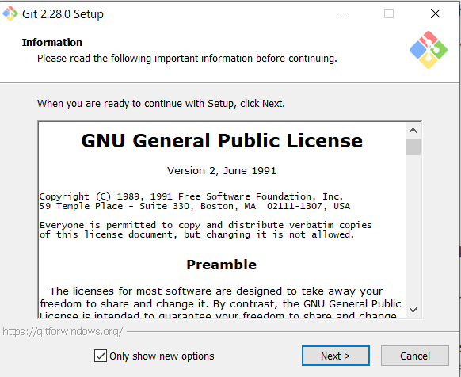
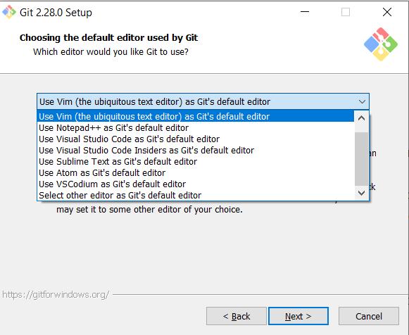
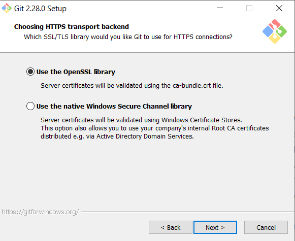
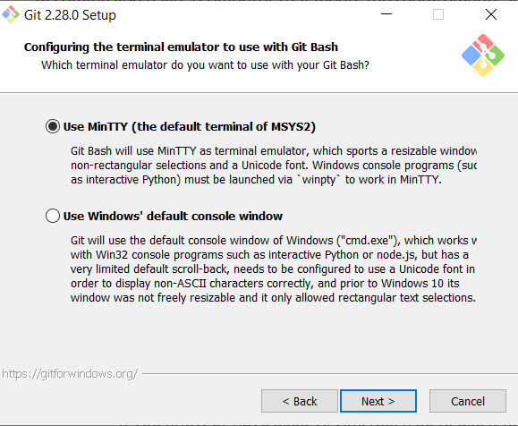
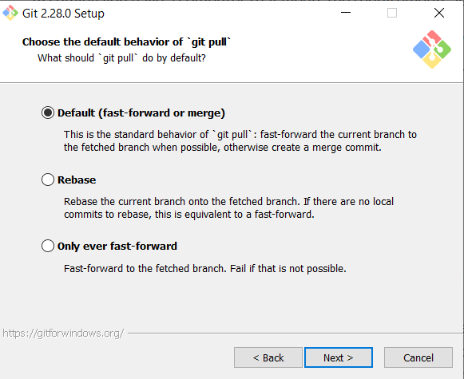
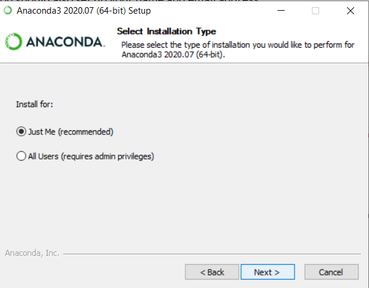
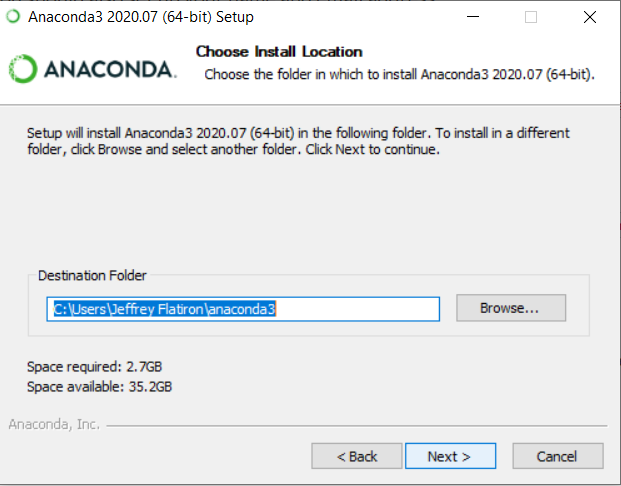
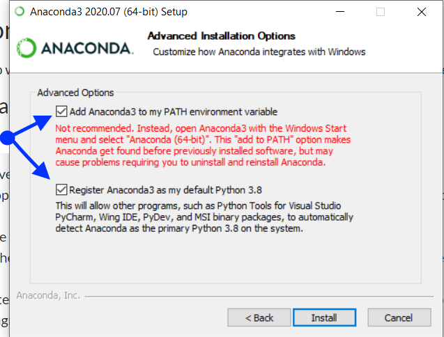
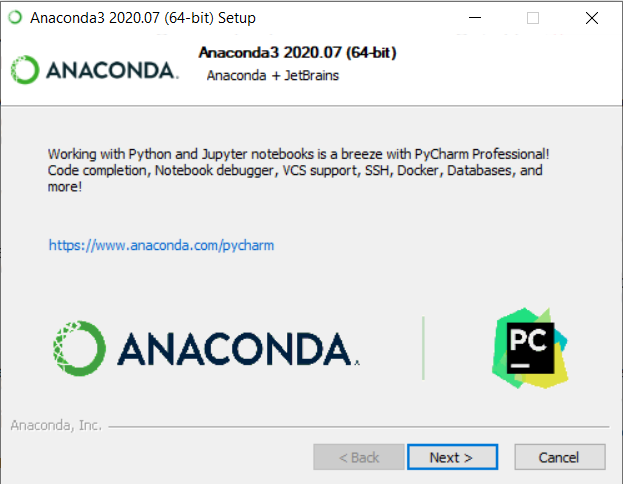

# Setting up a Professional Data Science Environment - Windows Installation

## Introduction

There are two major pieces we need to install in order to set you up for success as a professional data scientist! In this lesson, we will be installing Git and Anaconda for Windows.

## Objectives

You will be able to:

* Install Git
* Install Anaconda

Let’s start by getting Git and Anaconda installed.

Please note - the exact names and versions will change over time.

## Installing Git

### Overview: 

1. Download the install package from <a href="https://git-scm.com/download/win" target="_blank">here</a>.
    - If you do not know whether you need the 32 or 64-bit install, check your system type. On Windows 10, head to Settings > System > About. Under the Device specifications header, next to System type, you’ll see if Windows and your processor are 32-bit or 64-bit.
2. Open the downloaded exe file
    - You can either click the downloaded file at the bottom of your browser to open, or navigate to your downloads folder
    - It may open a window asking if you want to allow this application to make changes to your device, click “Yes”
    - Click “Next” to accept the license
3. Select the installation destination
    - The default option is recommended
4. Select components
    - Make sure to keep the “Windows Explorer integration” options checked
    - Otherwise, the default options are recommended
5. Choose a default editor that you are comfortable with, or choose either Nano or Visual Studio Code if you have not used an editor before
    - If you know or have used vi/vim, feel free to use it (otherwise it is not recommended)
    - You must have the editor installed to continue.  You can set a default now and change it later.
6. Adjust the PATH environment
    - Select “Use Git from the Windows Command Prompt”
    - The first option is also fine, as you’ll mainly be using Git from the new “Git Bash” program that is being installed, but the second option is ideal as it’ll give you the option of using it through either Git Bash or the Windows Command Prompt in the future if you wish
7. Choose HTTPS transport backend. 
    - Select the “Use the OpenSSL library” option
8. Configure line-ending conversions
    - The default option is recommended
9. Configure the terminal emulator
    - Select MinTTY as the default terminal emulator
10. Choose the default behavior of `git pull`
    - The default option is recommended
11. Configure extra options to enable file system caching
12. Choose a credential helper
    - Select Git Credential Manager
13. Wait while Git is installed onto your computer
14. Click "Finish" to complete set-up
    - It is not necessary to view the release notes

\* It is **strongly recommended** that you select any options to install and use the "Git Bash" shell - it's generally included by default. The Git Bash shell will allow students with either Windows or Mac computers to run the same set of commands, and all commands in this program follow that convention.

Note - if there are any differences in the options provided in the installer you download, accept the defaults.

#### Git Installation Steps Step-by-Step:

Step 1: Git’s download page for Windows OS - choose 32-bit or 64-bit option

Step 2: Open the downloaded file - on the license prompt, click “Next” to accept

   

Step 3: Select the installation destination folder (default is recommended)

   

Step 4: Select components - keep the “Windows Explorer integration” options

Step 5: Choose the default editor - choose Nano or Visual Studio Code if you have not used an editor before

Step 6: Adjust the PATH environment - second option is recommended

Step 7: Choose the HTTPS transport backend - choose OpenSSL library

Step 8: Configure line ending conversions - select the default option

Step 9: Configure the terminal emulator - choose MinTTY

Step 10: Choose “Default” as the default behavior of ‘git pull’

Step 11: Configure extra options to enable file system caching

Step 12: Choose Git Credential Manager as the credential helper

Step 13: Install

Step 14: Installation Complete - Click "Finish" to exit Setup (do not need to view release notes)

### Confirming Your Git Installation

To confirm you have installed Git successfully:

1. Open a terminal window
    - When we ask you to use the terminal, we mean the Git Bash application we just installed through Git
2. Type `git --version`: It should return the version of git you are running

---

## Installing Anaconda 

The easiest way to get set up with Python and Jupyter Notebook so you can start coding is to install the Anaconda distribution. 

### Overview:

1. Download the latest version of Anaconda <a href="https://www.anaconda.com/download/#windows" target="_blank">here</a>
    - Same as with the Git installation - If you do not know whether you need the 32 or 64-bit install, check your system type.
    - A window may pop up asking if you want to give Anaconda your information in return for a cheat sheet - you do not need to do so unless you want to.
2. Open the .exe file once it has downloaded to open the Anaconda installer
    - Click "Next", then "I Agree" to accept the license
3. Install for "Just Me"
4. Select the destination folder
    - The default option is recommended
5. **Choose both Advanced Installation Options** 
    - Although you will see a warning from the installer, **_make sure_** to choose _both_ "Add Anaconda to my PATH environment variable" _and_ "Register Anaconda as my default Python" !!
    - For this program, these options will actually avoid you needed to uninstall and reinstall Anaconda in the near future, which is what they're warning about
6. Wait while Anaconda is installed on your computer
    - You can ignore any supplementary materials advertised, such as PyCharm
7. When it thanks you for installing Anaconda, click "Finish"
    - You do not need to learn more about your installation, and can close the browser window if one opens

#### Anaconda Installation Step-by-Step:

Step 1: Anaconda’s download page for Windows OS - choose 32-bit or 64-bit option

  

Step 2: Open the downloaded file - on the license prompt, click “I Agree” to accept

  

Step 3: Select “Just Me” for Installation Type

  

Step 4: Select the installation destination folder (default is recommended)

  

Step 5: **Make sure to choose both Advanced Installation Options!**

  

Step 6: Installing Anaconda

  

Step 6, Continued: You can skip any add-ons, like the PyCharm installation

  

Step 7: Installation Complete - click “Finish”

  

### Confirming Your Anaconda Installation

To confirm you have installed Anaconda successfully:

1. Open a terminal window
2. Type `conda info`: It should return a table of details about your conda installation

## Summary

Congratulations! If you've gotten this far and everything has worked, you have successfully installed Git and Anaconda on your Windows PC! 
